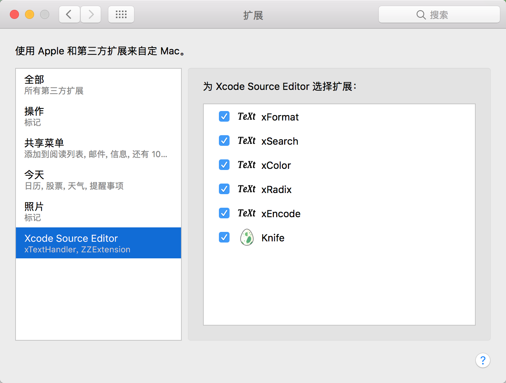
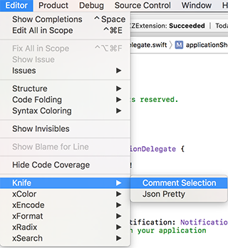

# ZZExtension
# What is it
[Xcode Source Editor Extension](https://developer.apple.com/videos/play/wwdc2016/414/)
`Xcode 8` Comment Shortcut Disabled sometimes.
Solution is 'sudo /usr/libexec/xpccachectl' and reboot
It's boring. So I write the extension

# Features
- [x] Comment Selections
- [x] Format Json
- [ ] Encode/Decode

# Build
0. Install `Xcode 8`
1. `sudo /usr/libexec/xpccachectl`
2. Sign every targets (app & extensions) using your developer certificate
3. Build to get ZZExtension.app
4. Copy ZZExtension.app to Application
5. 系统偏好设置-》扩展-》Xcode Source Editor设置

6. Open `Editor` menu to find extensions

## Comment Selections

# Reference
https://github.com/cyanzhong/xTextHandler/
